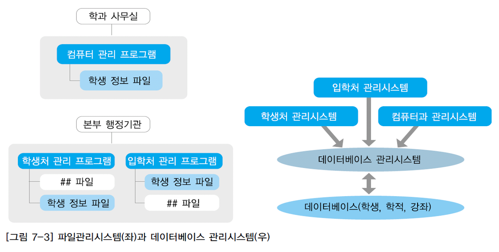
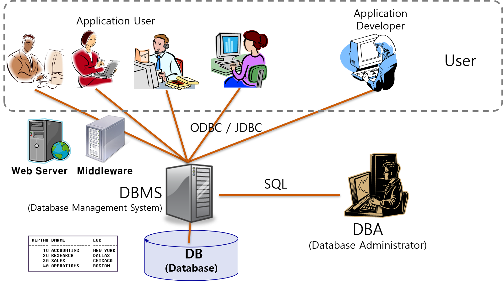
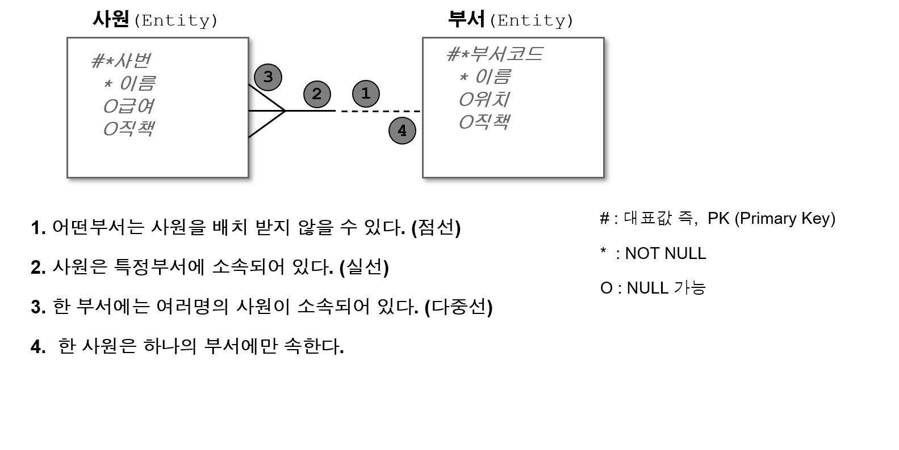
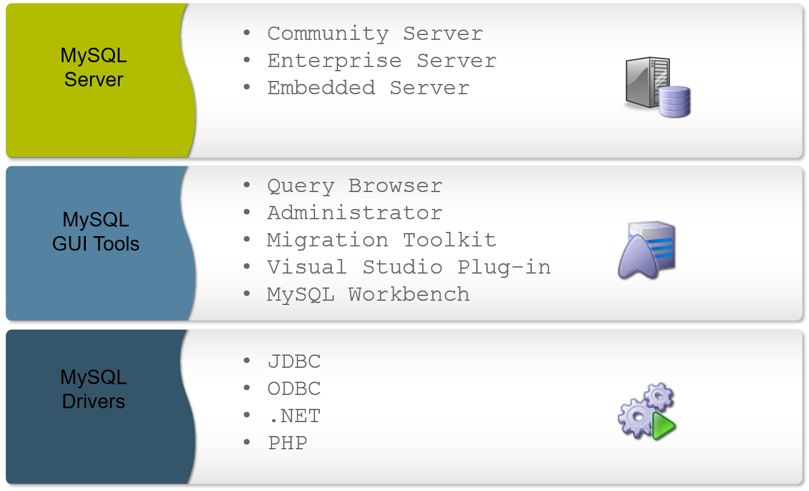

## 1. 데이터베이스의 특성
- 실시간 접근성(Real-time Accessability)
    사용자의 요구를 즉시 처리할 수 있다.
- 계속적인 변화(Continuous Evolution)
    정확한 값을 유지하려고 삽입·삭제·수정 작업 등을 이용해 데이터를 지속적으로 갱신할 수 있다.
- 동시 공유성(Concurrent Sharing)
     사용자마다 서로 다른 목적으로 사용하므로 동시에 여러 사람이 동일한 데이터에 접근하고 이용할 수 있다.
- 내용 참조(Content Reference)
     저장한 데이터 레코드의 위치나 주소가 아닌 사용자가 요구하는 데이터의 내용, 즉 데이터 값에 따라 참조할 수 있어야 한다.

## 2. 데이터 베이스 관리 시스템 ( Database Management System  =  DBMS )
데이터베이스를 관리하는 소프트웨어
여러 응용 소프트웨어(프로그램) 또는 시스템이 동시에 데이터베이스에 접근하여 사용할 수 있게 한다  
필수 3기능
     정의기능 :  데이터 베이스의 논리적, 물리적 구조를 정의
     조작기능 : 데이터를 검색, 삭제, 갱신, 삽입, 삭제하는 기능
     제어기능 :  데이터베이스의 내용 정확성과 안전성을 유지하도록 제어하는 기능 
Oracle,  SQL Server, MySQL, DB2 등의 상용 또는 공개 DBMS가 있다.

파일 시스템과의 비교
데이터의 종속성 보완
중복성 제거

- 데이터 베이스 관리 시스템  장점
데이터 중복이 최소화
데이터의 일관성 및 무결성 유지  
데이터 보안 보장

- 데이터 베이스 관리 시스템  단점
운영비가 비싸다
백업 및 복구에 대한 관리가 복잡
부분적 데이터베이스 손실이 전체 시스템을 정지

## 2.1 데이터 베이스의  종류
- 관계형 데이터베이스 (  Relational Database = RDB )
1970년 IBM E. F. Codd 에 의해 제안되어 수 십년동안 주류 데이터베이스로 성장 확대
키와 값들의 간단한 관계를  테이블화 시킨 매우 간단한 원칙의 개념의 데이터베이스
일련의 정형화된 테이블로 구성된 데이터 항목들의 집합이며 각 테이블은 데이터의 성격에
따라 여러 개의 컬럼(키)이 포함된다.      
사용자는 SQL이라는 표준 질의어를 통해 데이터를 조작 또는 조회 할 수 있다.
     
- 객체 지향 데이터베이스 ( Object Oriented DataBase = OODB )
정보를 객체의 형태로 표현하는 데이터베이스
객체 모델이 그대로 데이터베이스에도 적용되어 데이터 모델을 그대로 응용프로그램 에 적용,  데이터 변환과 질의 작업이 필요치 않은 장점

- 객체 관계형 데이터베이스 (  Object Relation DataBase = ORDB )
     관계형 데이터베이스에서 사용하는 데이터를 확장
     관계형 데이터베이스를 객체 지향 모델링과 데이터를 관리하는 기능을 갖도록 확장한 것 

- NoSQL
     대용량 데이터의 웹 서비스와 SNS, 클라우드 컴퓨팅의 확대 보급과 대중화로  최근 주목 받는 데이터베이스 기술      

## 3. 관계형 데이터 베이스

- 논리적(개념적) 데이터 모델링  &  물리적인 데이터베이스

ERD 예시

- Entity (개체, 실체)
데이터베이스 논리적 구성요소로서, 데이터베이스에 표현하려는 유형, 무형의 개체로 현실세계에서 사람이 생각하는 개념이나 정보의 단위이다. 즉, 데이터베이스에 표현하려는 것으로 사람이 생각하는 개념이나 정보단위 같은 현실 세계의 대상체

- PK (Primary Key) : 기본키
릴레이션에서 투플을 구별하기 위해 여러 개의 후보키를 모두 사용할 필요는 없다. 데이터베이스 설계자나 관리자는 여러 후보키 중에서 기본적으로 사용할 키를 반드시 선택해야 하는데 이것이 기본키(primary key)다.

■ 널 값을 가질 수 있는 속성이 포함된 후보키는 기본키로 부적합하다
■ 값이 자주 변경될 수 있는 속성이 포함된 후보키는 기본키로 부적합하다
■ 단순한 후보키를 기본키로 선택한다

- 테이블(table)

테이블 : RDBMS의 기본적 저장구조   한 개 이상의 column 과 0개 이상의 row로 구성
열(Column): 테이블 상에서의 단일 종류의 데이터를 나타냄 특정 데이터 타입 및 크기를 가지고 있음 
행(Row): Column들의 값의 조합. 레코드라고 불린다.
             기본키(PK)에 의해 구분된다. 기본키는 중복을 허용하지 않으며 없어서는 안 된다. 
Field : Row 와  Column의 교차점으로 Field는 데이터를 포함할 수 있고 없을 때는 NULL 값을 가
          지고 있다고 한다.

## 4. SQL
데이터베이스  스키마 생성, 자료의  검색, 수정, 그리고 데이터베이스 객체 접근 관리 등을 위해 고안된 언어
다수의 데이터베이스  관련 프로그램의  표준언어

- SQL 명령어의 종류
     1. DML ( Data Manipulation Language)  : 데이터 조작어로 검색 및 수정하기 위한  수단제공
         - SELECT, INSERT, UPDATE, DELETE, MERGE
     2. DDL  ( Data Definition Language ) : 데이터 구조를  생성,  변경, 삭제등의 기능을  제공
         - CREATE, ALTER, DROP, RENAME
     3. DCL  ( Data Control Lanuage )  –  데이터에 대한 권한 관리 및 트랜잭션 제어  
         - GRANT, REVOKE
RDBMS - MariaDB 

### 1. MySQL 
1) 세계에서 가장 인기 있는  Open source DB (하루 50,000번 이상 다운로드)

2) 1995년 첫 공식 버젼 발표(MySQL AB)

3) 2001년 GNU GPL 등록

4) 2008년 1월 SUN에서 인수(2010년 오라클 SUN인수로 오라클에서 현재 소유)

5) Open source LAMP/SAMP stack으로 급성장

6) 1000여개 SW 및 HW 회사에 번들로 설치

7) 오라클 인수 후,  MySQL를 다른 DBMS에서 교체하는 움직임이 있다) 

8) DB관리 TCO의 획기적인 감소

9) OracleDB, MS SQL과 함께 2019년 현재 3대 DBMS 로 많이 사용되고 있다.

10) 주요 버젼(Community Server)

     5.1(2008년, InnoDB 1.0)

     5.5(2010년, InnoDB 1.1)

     5.6(2011년, 퀄리 옵티마이저 성능 향상)

     현재(2019년) 8.0 

ODBC
Open DataBase Connectivity는 마이크로소프트가 만든, 데이터베이스에 접근하기 위한 소프트웨어의 표준 규격으로, 각 데이터베이스의 차이는 ODBC 드라이버에 흡수되기 때문에 사용자는 ODBC에 정해진 순서에 따라서 프로그램을 쓰면 접속처의 데이터베이스가 어떠한 데이터베이스 관리 시스템에 관리되고 있는지 의식할 필요 없이 접근할 수 있다.

JDBC
Java database connectivity. 이 API(application programming interfaces) 세트는 ODBC와 유사하게 자바 애플릿이 데이터 베이스를 다룰 수 있는 표준적인 방법을 제공한다.

### 2. MariaDB
1) Monty Program AB라는 회사에서 만든 독립적인 RDBMS

2) MySQL 커뮤니티 코드 베이스를 이용해서 탄생(MySQL 커뮤니티 버젼과 상당부분 호환)

3) MariaDB는 오픈소스이다.

4) MySQL과의 공통점

    - Binary Drop in replacement MySQL (데이터 파일들이 호환)

    - 실행 프로그램과 유틸리티는 모두 MySQL과 이름이 동일하며 호환된다.
 
    - 모든 클라이언트 API와 프로토콜은 호환된다.

    - 모든 파일과 포트및 파일의 경로가 동일

    - MySQL Connector(Java, c) 모두 변경 없이 사용 가능

    - MySQL 클라이언트 프로그램은 변경없이 MariaDB  서버의 연경에 사용할 수 있다.

5) MySQL과의 차이점

    - 라이센스

    - 옵티마이저(디스크 읽기/쓰기, 조인, 서브쿼리, 임시테이블 & 뷰) 에서 차이가 있다.

    - 내부 스토리지 엔진(메모리 스토리지, 임시 테이블 스토리지, 트랜잭션, NoSQL지원)
 
       에서 MariaDB 10.x 부터 차이를 보인다.

### 3. Basic Queries
여러 문장을 한 줄에 연속으로 붙혀 쿼리 실행이 가능하다.  
    각 문장에 semicolon(;)만 붙혀 주면 된다.

	mysql> SELECT VERSION(); SELECT NOW();

MySQL은 문장의 끝을 라인으로 구분하는 것이 아니라 semicolon(;)으로 구분하기 때문에 여러줄에 거쳐 문장을 쓰는 것도 가능하다.

	mysql> SELECT
    	       -> USER()
    	       -> ,
   	       -> CURRENT_DATE;

긴 쿼리를 작성하다가 중간에 취소해야하는 경우에는 즉시. \c를 붙혀주면 된다.

	mysql> SELECT
    	      -> USER()
    	      -> \c

현재 서버에 존재하는 데이터베이스를 찾아보기 위해서 SHOW statement을 사용한다.

	mysql> show databases;

새 database를 생성하기 위해 “create database” command 사용

	mysql> create database webdb;

Database을 선택하기 위해,  “use” command 사용

	mysql> use webdb;

- Table 생성

Database를 선택 후,  Database의 전체 테이블 목록을 출력

	mysql> show tables;

Table 생성을 위해, CREATE TABLE command 사용

	mysql> CREATE TABLE pet (
	      -> name VARCHAR(20),
	      -> owner VARCHAR(20),
	      -> species VARCHAR(20),
	      -> gender CHAR(1),
	      -> birth DATE,
	      -> death DATE  );

	      ->desc pet;
